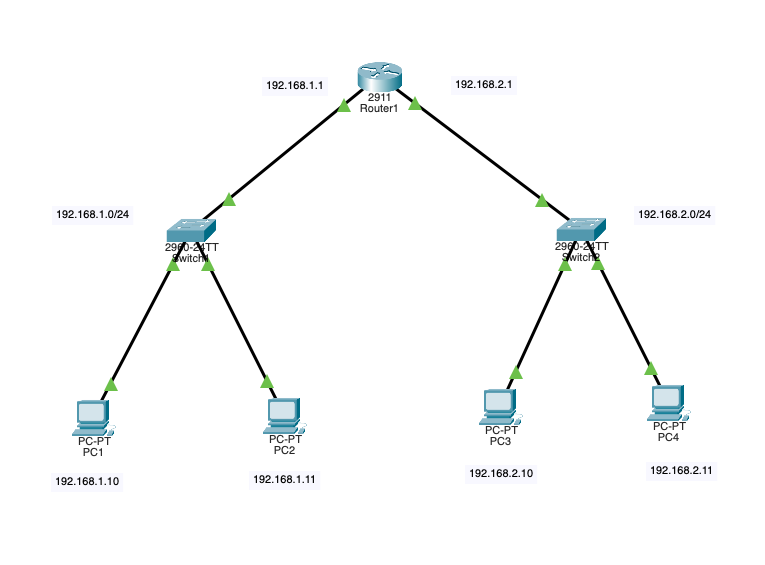

# Cisco Packet Tracer Project: Basic Network Design

## **Overview**

This repository contains the configuration files for a basic network design project created using Cisco Packet Tracer. The project demonstrates fundamental networking concepts and configurations, including router and switch setup, IP addressing, and basic network connectivity.

---

## Network Diagram

---

## **Project Details**

- **Network Topology**: Includes a simple LAN with one router, two switches, and four PCs.
- **Configurations**: Contains configuration files for routers and switches.
- **Purpose**: Designed to illustrate core networking principles such as IP addressing, VLANs, and routing basics.

---

## **Files Included**

- [Network Topology](network_topology.pkt): Cisco Packet Tracer file with the network design and configuration.
- [Router1 Configuration](configs/router1_config.md): Configuration commands used on the router.
- [Switch1 Configuration](configs/switch1_config.md): Configuration commands used on the switch1.
- [Switch2 Configuration](configs/switch2_config.md): Configuration commands used on the switch2.
- [Requirements](requirements.md): Detailed requirements and specifications for the project.

---

## **How to Use**

1. **Open the Packet Tracer File**: Download and open [Network Topology](network_topology.pkt) using Cisco Packet Tracer.
2. **Review Configurations**: Examine [Router1 Configuration](configs/router1_config.md), [Switch1 Configuration](configs/switch1_config.md) and [Switch2 Configuration](configs/switch2_config.md) for the detailed configuration commands.
3. **Understand Project Requirements**: Refer to [Requirements](requirements.md) to understand the complete project requirements and specifications.

---

## **Goals**

- Demonstrate basic network setup and configuration.
- Provide a foundation for more advanced networking projects.
- Serve as a reference for learning and troubleshooting basic networking concepts.

---
